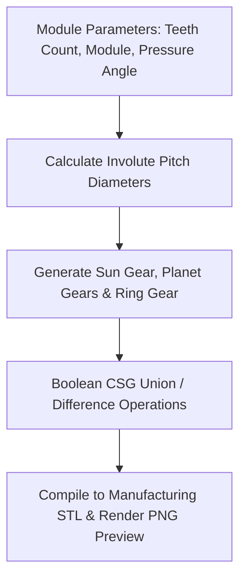

# Generative Parametric Planetary Gearbox (OpenSCAD)

## Executive Overview
A generative parametric CAD design system written in **OpenSCAD**. It mathematically derives **involute gear tooth profiles**, computes pitch diameters and gear ratios, and models an entire 3D-printable planetary gearbox assembly with backlash tolerances for high-torque robotic actuators.

## Geometric Generation Pipeline



### Source Tree
- **`src/planetary_gearbox.scad`**: Parametric OpenSCAD code implementing involute tooth geometry, carrier plates, and sun/planet gears.
- **`render.sh`**: Build script automating STL compilation and raytraced image generation.
- **`runner/run.js`**: Geometric validation harness calculating gear ratios and tooth mesh tolerances.

## Mathematical Formulation: Involute Gear Trigonometry
For module m, tooth count z, and pressure angle \phi:
$$\text{Pitch Diameter: } d = m \cdot z$$
$$\text{Base Circle: } d_b = d \cdot \cos(\phi)$$
$$\text{Planetary Ratio: } R = 1 + \frac{Z_{\text{ring}}}{Z_{\text{sun}}}$$

## Native OpenSCAD Rendering
```bash
openscad -o build/planetary_gearbox.stl src/planetary_gearbox.scad
```

## Universal Verification
```bash
node runner/run.js
node orchestrator/run.js --project=29-openscad
```

## Senior Interview Q&A
- **Q: What is the advantage of script-based CAD over GUI tools like SolidWorks?** Complete version control: CAD models are human-readable code in Git. Parametric changes (e.g. changing gear ratio from 4:1 to 7:1) can be tested in automated CI pipelines without manual GUI interaction.
- **Q: How is 3D printing tolerance accounted for?** The script defines a parametric `backlash` variable that offsets gear teeth profiles uniformly, preventing binding when printed on FDM or SLA 3D printers.\n
